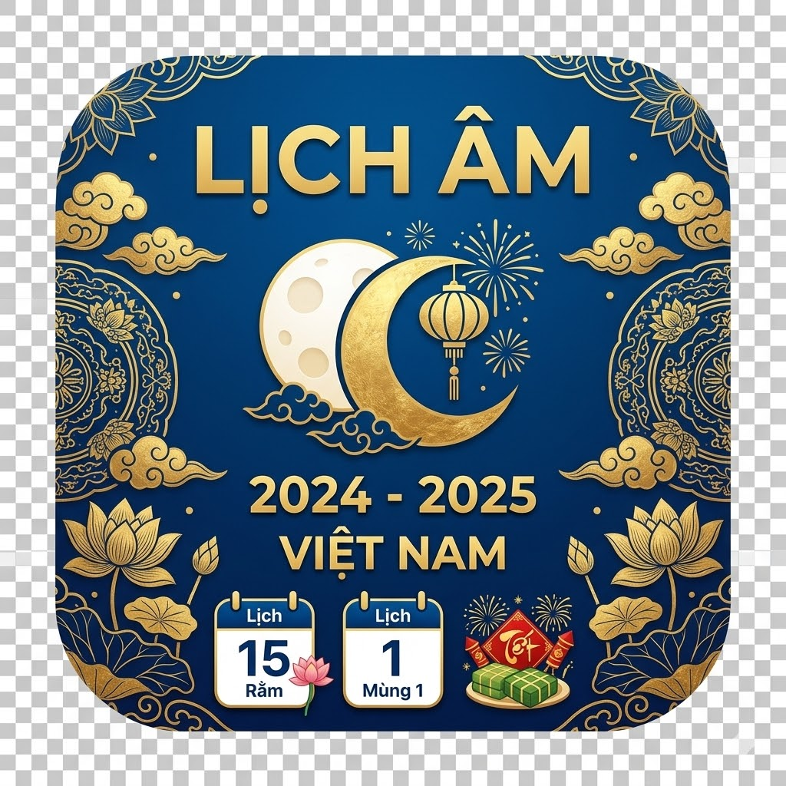

# 🌙 lich_am_gia_toc

<p align="center">
  
</p>

<h2 align="center">Ứng dụng lịch âm Việt Nam cho gia đình và dòng họ</h2>

<p align="center">
  <b>Lưu giỗ chạp · Nhắc lịch âm · Thống kê sự kiện · Google Calendar Sync · Windows & Android</b>
</p>

<p align="center">
  
  
  
  
</p>

---

## Giới thiệu

**lich_am_gia_toc** là ứng dụng Flutter đa nền tảng dùng để xem lịch âm Việt Nam, lưu sự kiện gia đình/dòng họ theo âm lịch và tự nhắc lại theo tháng, quý hoặc năm.

Ứng dụng phù hợp để quản lý:

- Giỗ ông bà, cha mẹ.
- Chạp họ, giỗ họ.
- Ngày sinh âm lịch.
- Ngày mất, ngày kỵ.
- Sự kiện truyền thống của gia đình, dòng họ.

Trọng tâm của ứng dụng là **lịch âm**. Ngày âm được hiển thị nổi bật, ngày dương chỉ đóng vai trò phụ trợ. Khi lưu sự kiện âm lịch, ứng dụng tự quy đổi sang dương lịch theo từng năm để hiển thị và lập lịch nhắc.

---

## Tính năng chính

### Lịch âm là trung tâm

- Ngày âm hiển thị lớn, màu đỏ, nằm bên trái ô lịch.
- Chữ **âm** nằm dưới ngày âm.
- Ngày dương hiển thị phụ, màu đen, nằm bên phải ô lịch.
- Tuần bắt đầu từ **Thứ 2**.
- Thứ 7 và Chủ nhật có nền khác để dễ nhận biết.
- Ô lịch tự co giãn theo kích thước cửa sổ Windows và màn hình Android.
- Hỗ trợ các chế độ xem:
  - Tuần.
  - Tháng.
  - Năm.
  - 5 năm.
  - Danh sách sự kiện.
  - Thống kê sự kiện trong năm.
  - Google / Sao lưu.

### Sự kiện âm lịch

Mỗi sự kiện có thể cấu hình:

- Tên sự kiện.
- Ghi chú.
- Ngày âm.
- Tháng âm.
- Tháng nhuận.
- Giờ/phút nhắc.
- Chu kỳ nhắc:
  - Hằng tháng âm lịch.
  - Hằng quý âm lịch.
  - Hằng năm âm lịch.
- Nhắc trước theo ngày hoặc giờ.

### Thông báo

Android:

- Thông báo trên thanh thông báo.
- Thông báo trong bảng thông báo.
- Hỗ trợ thông báo ưu tiên cao.
- Hỗ trợ quyền thông báo và lịch nhắc chính xác.

Windows:

- Thông báo hệ thống.
- Thông báo nổi trong ứng dụng.
- Nút tắt.
- Nút nhắc lại.
- Hỗ trợ system tray.

### System tray trên Windows

- Có biểu tượng ứng dụng ở system tray.
- Có tùy chọn ẩn xuống tray khi đóng cửa sổ.
- Bấm chuột trái để hiện lại cửa sổ.
- Chuột phải có menu:
  - Hiện cửa sổ.
  - Thoát hoàn toàn.
- Icon tray được xử lý theo đúng đường dẫn của bản release.

### Google Calendar và sao lưu

- Đăng nhập Google bằng OAuth Device Code.
- Đẩy sự kiện lên Google Calendar.
- Tải sự kiện từ Google Calendar về ứng dụng.
- Sao lưu JSON.
- Khôi phục JSON.

### Build ổn định

Windows:

- Build qua thư mục tạm đường dẫn ngắn:
  - `C:\_lich_am_gia_toc_build`
- Tự xóa build tạm sau khi hoàn tất.
- Giữ build log trong:
  - `logs/windows_build_YYYYMMDD_HHMMSS.log`
  - `logs/windows_debug_YYYYMMDD_HHMMSS.log`
  - `logs/windows_release_YYYYMMDD_HHMMSS.log`

Android:

- Build debug cho máy ảo `x86_64`.
- Build release cho điện thoại thật `arm64-v8a`.
- Build universal cho `android-arm`, `android-arm64`, `android-x64`.
- APK release được ký bằng `zipalign` và `apksigner`.

---

## Nền tảng hỗ trợ

| Nền tảng | Trạng thái |
|---|---|
| Windows 10/11 | Hỗ trợ |
| Android | Hỗ trợ |
| iOS | Mã nguồn dự phòng, cần macOS/Xcode để build |
| macOS | Có thể mở rộng |
| Linux | Có thể mở rộng |

---

## Cấu trúc thư mục

```text
lich_am_gia_toc/
├─ lib/
│  └─ main.dart
├─ assets/
│  └─ icons/
│     ├─ app_icon.png
│     ├─ app_icon_256.png
│     └─ app_icon.ico
├─ tools/
│  ├─ PATCH_ANDROID_CLEAN.py
│  ├─ PATCH_WINDOWS_CLEAN.py
│  └─ SIGN_ANDROID_APK_FINAL.py
├─ BUILD_ANDROID_CLEAN.bat
├─ BUILD_WINDOWS_CLEAN.bat
├─ BUILD_WINDOWS_DEBUG_ONLY.bat
├─ BUILD_WINDOWS_RELEASE_ONLY.bat
├─ RUN_WINDOWS.bat
├─ pubspec.yaml
└─ README.md
```

Các thư mục sinh ra khi build, không cần commit:

```text
build/
.dart_tool/
android/
windows/
dist/
logs/
```

---

## Cài đặt môi trường

### Windows

Cần cài:

- Flutter SDK.
- Git for Windows.
- Visual Studio Community với workload **Desktop development with C++**.
- Android Studio nếu build Android.
- Android SDK Command-line Tools.
- Android SDK Platform-Tools.
- Android SDK Build-Tools.

Kiểm tra:

```bat
flutter doctor -v
```

### Android

Trong Android Studio:

```text
SDK Manager → SDK Tools
```

Cài:

```text
Android SDK Command-line Tools latest
Android SDK Platform-Tools
Android SDK Build-Tools
Android Emulator
```

Chấp nhận license:

```bat
flutter doctor --android-licenses
```

### iOS

Không build iOS trực tiếp trên Windows. Cần macOS và Xcode.

---

## Build Windows

```bat
cd /d M:\Flutter\lich_am_gia_toc
BUILD_WINDOWS_CLEAN.bat
```

Chọn:

```text
1 = DEBUG
2 = RELEASE
```

Có thể chạy trực tiếp:

```bat
BUILD_WINDOWS_DEBUG_ONLY.bat
BUILD_WINDOWS_RELEASE_ONLY.bat
```

Kết quả release:

```text
dist\lich_am_gia_toc
dist\lich_am_gia_toc.zip
```

Khi copy sang máy khác, copy cả thư mục hoặc dùng file zip. Không copy riêng file `.exe`.

---

## Build Android

```bat
cd /d M:\Flutter\lich_am_gia_toc
BUILD_ANDROID_CLEAN.bat
```

Chọn:

```text
1 = APK debug cho máy ảo Android x86_64
2 = APK release đã ký cho điện thoại thật arm64-v8a
3 = APK universal release đã ký: arm + arm64 + x64
```

File cài đúng:

```text
build\app\outputs\flutter-apk\app-release.apk
```

---

## Google Calendar Sync

1. Tạo Google Cloud project.
2. Bật Google Calendar API.
3. Tạo OAuth Client ID phù hợp với Device Code Flow.
4. Mở ứng dụng → **Google / Sao lưu**.
5. Dán Client ID.
6. Bấm **Đăng nhập Google**.
7. Dùng:
   - **Đẩy lên Google Calendar**.
   - **Tải từ Google Calendar**.

Ứng dụng nhận diện sự kiện của mình bằng metadata:

```text
lunar_family_calendar = true
```

---

## Sao lưu và khôi phục JSON

Vào:

```text
Google / Sao lưu
```

Sao lưu:

```text
Copy sao lưu
```

Khôi phục:

```text
Dán JSON → Khôi phục JSON
```

---

## Lỗi thường gặp

### `INSTALL_PARSE_FAILED_NO_CERTIFICATES`

Build lại Android bằng lựa chọn `2` hoặc `3`, sau đó cài:

```text
build\app\outputs\flutter-apk\app-release.apk
```

Nếu đã cài bản cũ khác chữ ký, gỡ app cũ rồi cài lại.

### `INSTALL_FAILED_NO_MATCHING_ABIS`

- Máy ảo Android Studio nên dùng `x86_64`.
- Điện thoại thật thường dùng `arm64-v8a`.
- Nếu cần một file cho nhiều máy, chọn universal.

### `JAVA_HOME is not set`

Nếu cần set thủ công:

```bat
set JAVA_HOME=C:\Program Files\Android\Android Studio\jbr
set PATH=%JAVA_HOME%\bin;%PATH%
```

### `FileTracker : error FTK1011`

Ứng dụng đã build qua đường dẫn ngắn để hạn chế lỗi này. Nếu vẫn gặp, xem log mới nhất trong thư mục:

```text
logs/
```

### `atlbase.h: No such file or directory`

Mở Visual Studio Installer và cài:

```text
C++ ATL for latest build tools
C++ MFC for latest build tools
```

---

## License

Dự án dùng cho mục đích cá nhân, gia đình và dòng họ. Có thể chuyển sang MIT License nếu công khai mã nguồn.
BUILD_ANDROID_CLEAN.bat
```

Chọn:

```text
1 = APK debug cho máy ảo Android x86_64
2 = APK release đã ký cho điện thoại thật arm64-v8a
3 = APK universal release đã ký: arm + arm64 + x64
```

File APK nằm tại:

```text
build\app\outputs\flutter-apk\
```

File cài đúng khi chọn release:

```text
build\app\outputs\flutter-apk\app-release.apk
```

Không dùng:

```text
app-release-aligned.apk
app-release-signed.apk
APK cũ
APK trong thư mục tạm
```

---

## 🔐 Google Calendar Sync

### Bước 1: Tạo Google Cloud project

Vào Google Cloud Console:

```text
APIs & Services → Credentials
```

Tạo OAuth Client ID phù hợp với Device Code Flow.

### Bước 2: Bật Google Calendar API

```text
APIs & Services → Library → Google Calendar API → Enable
```

### Bước 3: Nhập Client ID vào app

Trong ứng dụng:

```text
Google / Sao lưu → Google OAuth Client ID
```

Dán Client ID, bấm:

```text
Đăng nhập Google
```

### Bước 4: Đồng bộ

Có hai thao tác:

```text
Đẩy lên Google Calendar
Tải từ Google Calendar
```

Ứng dụng nhận diện sự kiện của mình bằng metadata:

```text
lunar_family_calendar = true
```

---

## 💾 Sao lưu và khôi phục JSON

Vào:

```text
Google / Sao lưu
```

### Sao lưu

Bấm:

```text
Copy sao lưu
```

Lưu JSON vào Google Drive, Gmail hoặc file riêng.

### Khôi phục

Dán JSON vào khung, bấm:

```text
Khôi phục JSON
```

---

## 🛠️ Lỗi thường gặp

### `INSTALL_PARSE_FAILED_NO_CERTIFICATES`

Nguyên nhân: APK chưa được ký hoặc cài nhầm file APK cũ.

Cách xử lý:

```bat
BUILD_ANDROID_CLEAN.bat
```

Chọn:

```text
2 hoặc 3
```

Cài file:

```text
build\app\outputs\flutter-apk\app-release.apk
```

Nếu đã cài bản cũ khác chữ ký, gỡ app cũ rồi cài lại.

### `INSTALL_FAILED_NO_MATCHING_ABIS`

Nguyên nhân: APK không chứa ABI phù hợp với máy.

- Máy ảo Android Studio nên dùng `x86_64`.
- Điện thoại thật thường dùng `arm64-v8a`.
- Nếu cần một file cho nhiều máy, chọn universal.

### `JAVA_HOME is not set`

Bản build đã tự set Java từ Android Studio JBR nếu có. Nếu vẫn lỗi, kiểm tra:

```bat
where java
echo %JAVA_HOME%
```

Có thể set thủ công:

```bat
set JAVA_HOME=C:\Program Files\Android\Android Studio\jbr
set PATH=%JAVA_HOME%\bin;%PATH%
```

### `FileTracker : error FTK1011`

Nguyên nhân thường do đường dẫn build quá dài.

Bản build Windows đã xử lý bằng cách build tạm trong:

```text
C:\_lagt_v15_build
```

Sau build sẽ tự xóa thư mục này và giữ log trong `logs/`.

### `atlbase.h: No such file or directory`

Mở Visual Studio Installer, cài thêm:

```text
C++ ATL for latest build tools
C++ MFC for latest build tools
```

### iOS không build trên Windows

iOS cần macOS/Xcode. Trên macOS:

```bash
flutter create -t app --platforms=ios .
flutter pub get
flutter build ios --release
```

---

## 📦 Release

Quy ước version trong `pubspec.yaml`:

```yaml
version: 15.0.0+150
```

Quy tắc:

```text
major.minor.patch+buildNumber
```

Ví dụ:

```text
15.0.1+151
15.1.0+160
16.0.0+200
```

---

## 📄 License

Dự án dùng cho mục đích cá nhân/gia đình/dòng họ. Có thể chuyển sang MIT License nếu công khai mã nguồn.
